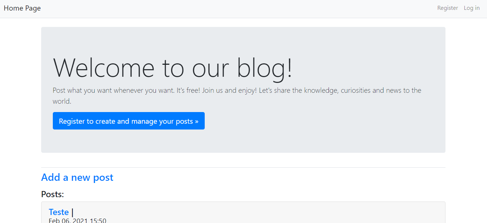
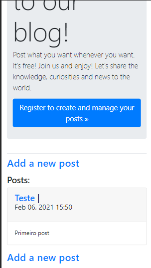
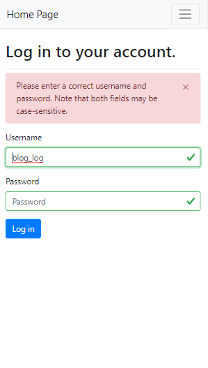

Public Blog with REST API
======

Similar to the Learning Log, this project was done on its own. The purpose of the web app is give to your users a local to externalize the contents of your mind to the world. Something like the Reddit forum.
The blog has a REST API made using Django Rest Framework.
------

On Public Blog the user and non-users can see all posts.  
To post the user must be logged and only the onwer post can edit it.

## Screenshots

- Desktop Screenshot  

- Mobile Screenshot  
  

## REST API

A model based REST API was created using Django Rest Framework.

## Live Demo

  
The project is live on Heroku, to visit click on [here](https://blog2all.herokuapp.com/).

## Getting started

To run the project, you will need to install the following software:

- [Python 3.9.*: Required to run the Python project](https://www.python.org/ftp/python/3.9.2/python-3.9.2-amd64.exe)
- [Django 3.1.*:  A Python Web framework.](https://pypi.org/project/Django/)
- [Gunicorn 20.*: A Python WSGI HTTP Server for UNIX, necessary to prepare the server on deploy.](https://pypi.org/project/gunicorn/)
- [Psycopg2 2.8.*: A PostgreSQL database adapter for the Python programming language.](https://pypi.org/project/psycopg2/)

### Features

- [x] User registration
- [x] Login / Log out de usuário
- [x] Public Post Visualization

## Authors

Marcos Garcia   
e-mail: mvrgarcia05@gmail.com
